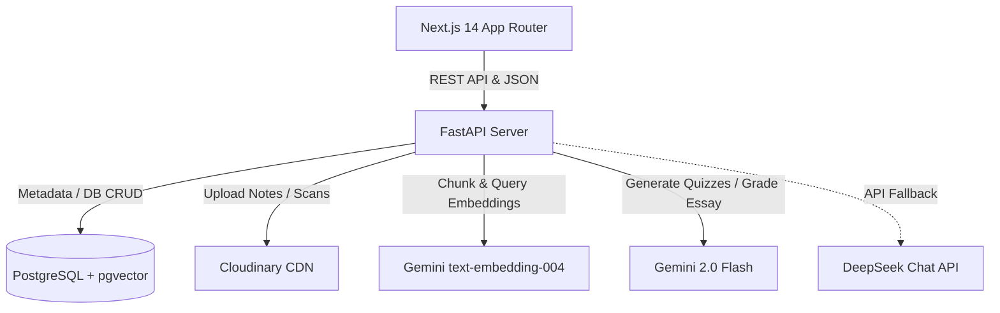

# EduQuiz AI 🎓🇳🇬

EduQuiz AI is a premium, AI-powered educational platform designed specifically for Nigerian students (Primary School, Junior/Senior Secondary School, Polytechnic, College of Education, and University levels) to transform any study material into interactive, personalized assessments.

By leveraging **Retrieval-Augmented Generation (RAG)**, EduQuiz AI parses textbooks, lecture slides, images, and notes, indexes them into a vector database, and generates standard assessments tailored to official Nigerian exam styles (e.g. **WAEC, JAMB, NECO, BECE**).

---

## 🚀 Key Features (Phase 1 MVP)

1. **RAG-Powered Knowledge Base**: Upload PDF, DOCX, PPT, TXT, or scan images of notes. The system chunks and generates 768-dimensional embeddings via Google Gemini, indexing them using `pgvector`.
2. **CBT Practice Exam Board**: Generates Multiple-Choice Questions (MCQ), Fill-in-the-Blank, True/False, and Theory/Essay questions.
3. **Official Exam Formats**: Simulated formatting matching WAEC, JAMB, NECO, and BECE certificate requirements.
4. **AI-Driven Evaluation**: Rule-based grading for structured questions paired with Gemini-driven evaluation and detailed feedback for essay/theory questions.
5. **Gamified Progress Tracking**: Earn XP points, maintain daily Streaks, and track performance history via a responsive glassmorphic dashboard.

---

## 🛠️ Architecture & Tech Stack



### Backend
- **Python 3.11+ / FastAPI**: Async controller layer.
- **SQLAlchemy 2.0 / Alembic**: Database migrations and ORM queries.
- **pgvector**: Cosine similarity matching on semantic study chunks.
- **Gemini 2.0 Flash**: Primary LLM engine for document parsing analysis, quiz generation, and essay evaluation.
- **DeepSeek Chat**: Secondary engine fallback.
- **PyMuPDF / python-docx / python-pptx**: Document parsers.

### Frontend
- **Next.js 14 (App Router / TypeScript)**: Component structure.
- **Tailwind CSS**: Custom dark glassmorphic styling system.
- **TanStack Query v5 / Axios**: Asynchronous data caching and mutation handling.
- **Zustand**: Client-side state management.
- **Framer Motion**: Smooth page transitions and micro-animations.

---

## 🔧 Getting Started

### Prerequisites
- Python 3.11+
- Node.js 18+
- PostgreSQL database with the `pgvector` extension installed.

---

### 1. Database Setup
1. Create a PostgreSQL database called `eduquiz`:
   ```sql
   CREATE DATABASE eduquiz;
   ```
2. Enable the vector extension (the backend startup lifespan script and migrations will handle this automatically if superuser permissions are granted):
   ```sql
   CREATE EXTENSION IF NOT EXISTS vector;
   ```

---

### 2. Backend Installation & Run
1. Navigate to the backend directory:
   ```bash
   cd backend
   ```
2. Create and activate a Python virtual environment:
   ```bash
   python -m venv .venv
   # Windows:
   .venv\Scripts\activate
   # macOS/Linux:
   source .venv/bin/activate
   ```
3. Install dependencies:
   ```bash
   pip install -r requirements.txt
   ```
4. Configure environment variables. Copy `.env.example` to `.env` and fill in your keys:
   ```bash
   copy .env.example .env
   ```
   *Required variables*:
   - `DATABASE_URL=postgresql+asyncpg://<username>:<password>@localhost:5432/eduquiz`
   - `GEMINI_API_KEY=your_google_gemini_api_key`
   - `CLOUDINARY_CLOUD_NAME=your_cloudinary_cloud_name`
   - `CLOUDINARY_API_KEY=your_cloudinary_api_key`
   - `CLOUDINARY_API_SECRET=your_cloudinary_api_secret`
5. Run database migrations:
   ```bash
   alembic upgrade head
   ```
6. Start the FastAPI server:
   ```bash
   uvicorn app.main:app --reload
   ```
   The backend API will run on `http://localhost:8000`. You can inspect the interactive docs at `http://localhost:8000/docs`.

---

### 3. Frontend Installation & Run
1. Navigate to the frontend directory:
   ```bash
   cd ../frontend
   ```
2. Install npm packages:
   ```bash
   npm install
   ```
3. Configure environment variables. Copy `.env.local.example` to `.env.local`:
   ```bash
   copy .env.local.example .env.local
   ```
   *Required variables*:
   - `NEXT_PUBLIC_API_URL=http://localhost:8000`
4. Start the Next.js development server:
   ```bash
   npm run dev
   ```
   The frontend application will run on `http://localhost:3000`.

---

## 🎨 Design System & Aesthetic Tokens
The frontend features a state-of-the-art dark glassmorphic design:
- **Background**: Sleek deep dark navy (`#080817`).
- **Surface Panels**: Translucent indigo-tinted cards (`rgba(15,15,45,0.7)`) with backdrop blur (`16px`) and subtle glowing border gradients.
- **Accents**: Neon purple (`#7C6FFF`), bright cyan (`#00D4FF`), and vibrant emerald green (`#00E5A0`).
- **Typography**: `Plus Jakarta Sans` for highly readable body copy, paired with `Space Grotesk` for numbers and section headings.
